# Agent Forge — Guía paso a paso para configurar OAuth en Google Cloud

> Arquitectura actual de pruebas:
>
> ```text
> Landing / presentación pública:
> https://www.agentforge.israellopez.org
>
> Frontend de la aplicación:
> https://agentforge.israellopez.org
>
> Backend/API:
> https://api.agentforge.israellopez.org
> ```

---

## 0. Arquitectura de dominios

En este entorno, hay tres dominios con responsabilidades distintas:

| Dominio                                  | Uso                                                  |
| ---------------------------------------- | ---------------------------------------------------- |
| `https://www.agentforge.israellopez.org` | Página pública de presentación del proyecto          |
| `https://agentforge.israellopez.org`     | Frontend real de la aplicación en entorno de pruebas |
| `https://api.agentforge.israellopez.org` | Backend/API de la aplicación en entorno de pruebas   |

Esto afecta directamente a Google OAuth:

```text
Terms y Privacy:
https://www.agentforge.israellopez.org/privacy
https://www.agentforge.israellopez.org/terms

JavaScript Origin de la app:
https://agentforge.israellopez.org

OAuth callback del backend:
https://api.agentforge.israellopez.org/api/oauth/google/callback
```

Importante:

```text
Terms / Privacy pueden estar en la landing pública.
El frontend OAuth debe estar en el dominio donde corre la app.
El callback OAuth de Gmail debe estar en el backend.
```

---

## 1. Qué vamos a configurar

Agent Forge necesita configuración OAuth para dos cosas diferentes:

1. **Login en el frontend**
   - Frontend real:
     ```text
     https://agentforge.israellopez.org
     ```
   - Variable principal:
     ```env
     VITE_GOOGLE_CLIENT_ID=<client-id>
     ```

2. **Autorización Gmail desde el backend**
   - Callback OAuth:
     ```text
     https://api.agentforge.israellopez.org/api/oauth/google/callback
     ```
   - Variables principales:
     ```env
     GOOGLE_OAUTH_CLIENT_ID=<client-id>
     GOOGLE_OAUTH_CLIENT_SECRET=<client-secret>
     GOOGLE_OAUTH_REDIRECT_URI=https://api.agentforge.israellopez.org/api/oauth/google/callback
     ```

Recomendación: crear dos OAuth Client IDs Web Application separados:

```text
Agent Forge Web Login
Agent Forge Gmail OAuth Backend
```

También se podría usar un solo cliente Web, pero separarlos evita confusiones entre login frontend y OAuth server-side de Gmail.

---

## 2. Enlaces oficiales útiles

### Consola

- Google Cloud Console: https://console.cloud.google.com/
- Google Auth Platform: https://console.cloud.google.com/auth
- Branding: https://console.cloud.google.com/auth/branding
- Audience: https://console.cloud.google.com/auth/audience
- Data Access: https://console.cloud.google.com/auth/scopes
- Clients: https://console.cloud.google.com/auth/clients
- Credentials: https://console.cloud.google.com/apis/credentials
- API Library: https://console.cloud.google.com/apis/library
- Enabled APIs: https://console.cloud.google.com/apis/dashboard
- Google Search Console: https://search.google.com/search-console

### Documentación Google

- Configure OAuth consent screen:
  https://developers.google.com/workspace/guides/configure-oauth-consent

- Get Google API Client ID:
  https://developers.google.com/identity/gsi/web/guides/get-google-api-clientid

- OAuth 2.0 for Web Server Applications:
  https://developers.google.com/identity/protocols/oauth2/web-server

- OAuth 2.0 Policies:
  https://developers.google.com/identity/protocols/oauth2/policies

- Brand verification:
  https://developers.google.com/identity/verification/authentication-verification

---

## 3. Seleccionar o crear el proyecto de Google Cloud

### Paso 3.1 — Entrar en Google Cloud Console

Abre:

```text
https://console.cloud.google.com/
```

Selecciona el proyecto donde quieres configurar Agent Forge.

Si todavía no tienes proyecto, crea uno nuevo.

Nombre recomendado:

```text
Agent Forge
```

ID aproximado recomendado:

```text
agent-forge-test
```

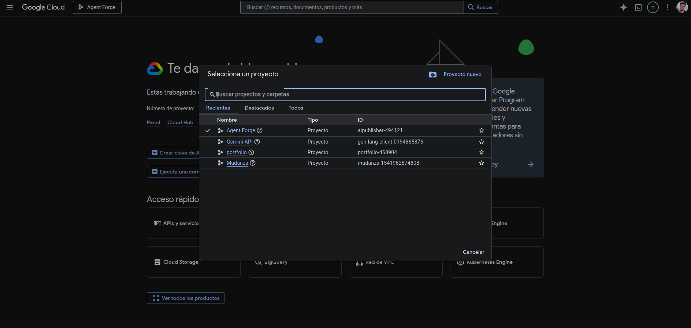

---

## 4. Habilitar APIs necesarias

Ve a:

```text
Google Cloud Console
→ APIs & Services
→ Library
```

Link:

```text
https://console.cloud.google.com/apis/library
```

Habilita estas APIs:

```text
Gmail API
Cloud Pub/Sub API
```

Para el OAuth de Gmail, **Gmail API** es obligatoria.

Para notificaciones push de Gmail, **Cloud Pub/Sub API** es obligatoria.

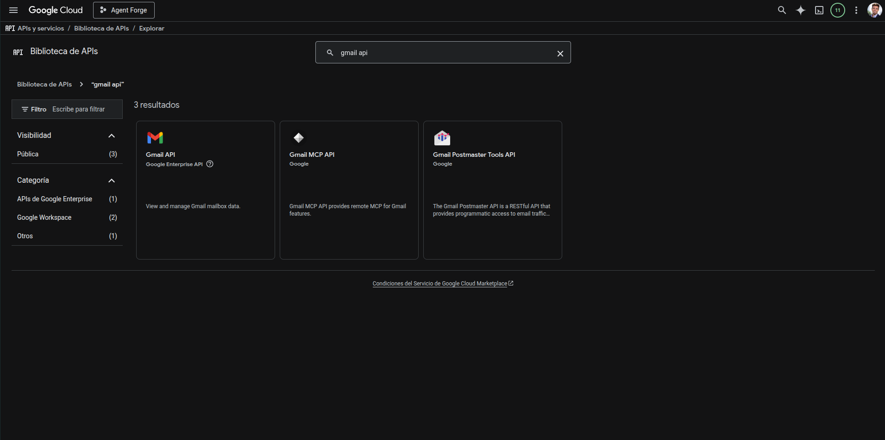
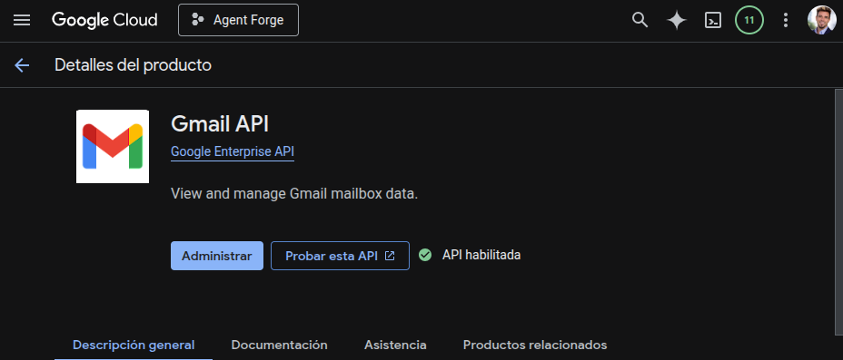

---

## 5. Configurar Google Auth Platform / OAuth Consent

Google organiza actualmente la configuración OAuth en:

```text
Google Auth Platform
```

La estructura habitual es:

```text
Branding
Audience
Data Access
Clients
```

### 5.1. Branding

Ve a:

```text
Google Cloud Console
→ Google Auth Platform
→ Branding
```

Link:

```text
https://console.cloud.google.com/auth/branding
```

Si aparece **Get Started**, pulsa ahí.

#### Paso 5.1.1 — App Information

Rellena:

```text
App name:
Agent Forge

User support email:
<tu email>
```

Ejemplo:

```text
israel.lopez.developer@gmail.com
```

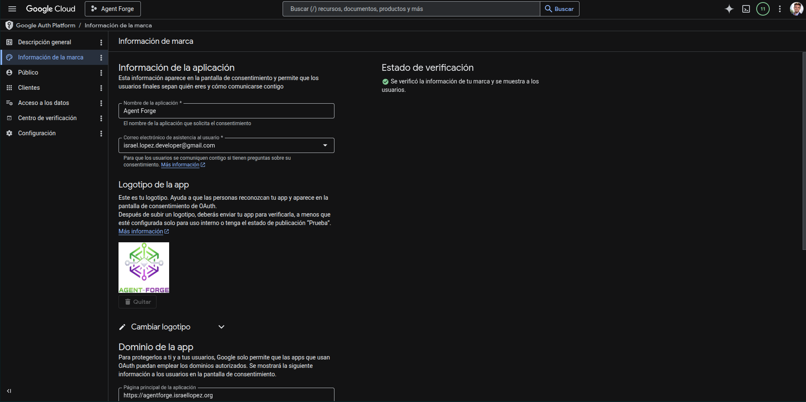

#### Paso 5.1.2 — App domain

Como la página pública de presentación está en `www`, configura aquí la landing pública:

```text
Application home page:
https://www.agentforge.israellopez.org

Application privacy policy:
https://www.agentforge.israellopez.org/privacy

Application terms of service:
https://www.agentforge.israellopez.org/terms
```

Esto es correcto aunque la aplicación real esté en:

```text
https://agentforge.israellopez.org
```

Motivo: Google permite que la política de privacidad y los términos estén en páginas públicas del dominio autorizado. Lo importante es que sean accesibles sin login, estén en un dominio verificado/autorizado y representen correctamente la app.

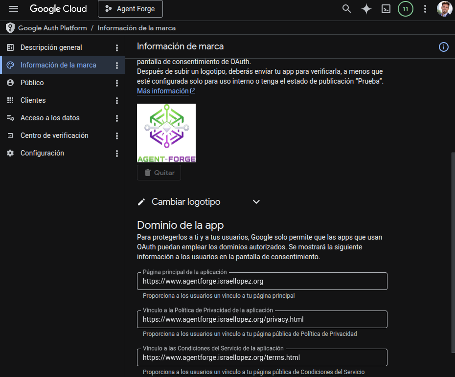

#### Paso 5.1.3 — Authorized domains

Añade el dominio raíz:

```text
israellopez.org
```

Para estos subdominios:

```text
www.agentforge.israellopez.org
agentforge.israellopez.org
api.agentforge.israellopez.org
```

el dominio propietario es:

```text
israellopez.org
```

Si Google muestra un error, verifica el dominio en:

```text
https://search.google.com/search-console
```

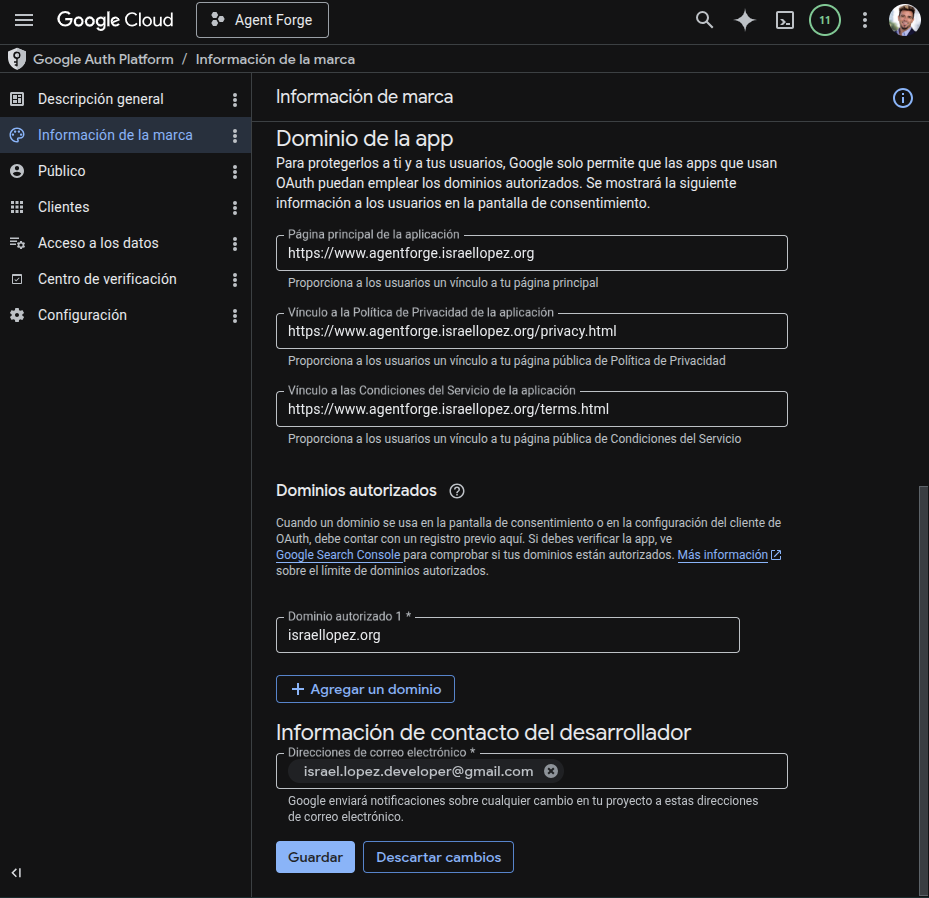

#### Paso 5.1.4 — Developer contact information

Rellena:

```text
Developer contact email:
<tu email>
```

Ejemplo:

```text
israel.lopez.developer@gmail.com
```

Guarda los cambios.

### 5.2 Audience

Ve a:

```text
Google Cloud Console
→ Google Auth Platform
→ Audience
```

Link:

```text
https://console.cloud.google.com/auth/audience
```

#### Paso 5.2.1 — User type

Para Agent Forge en pruebas con cuentas externas, selecciona:

```text
External
```

Usa **External** si quieres permitir cuentas Gmail o Google Workspace fuera de tu organización.

Usa **Internal** solo si el proyecto pertenece a una organización Google Workspace y la app será usada únicamente dentro de esa organización.

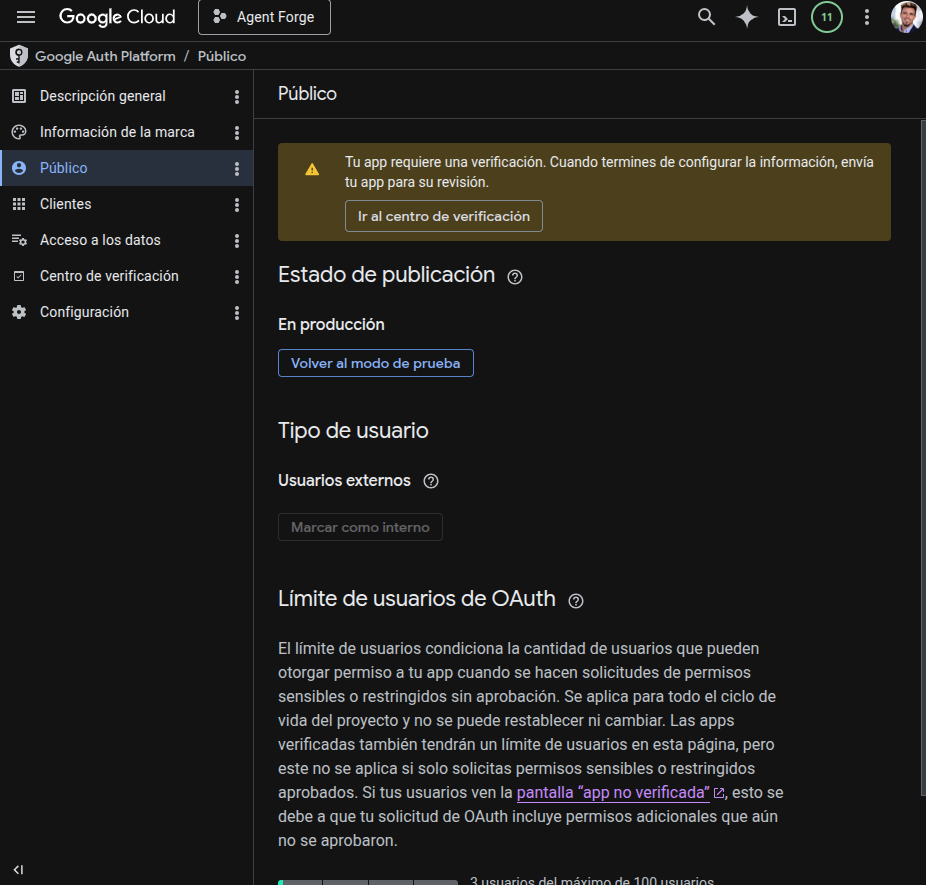

#### Paso 5.2.2 — Publishing status

Durante desarrollo/pruebas:

```text
Testing
```

Para producción pública:

```text
In production
```

Recomendación para este entorno actual:

```text
Testing
```

#### Paso 5.2.3 — Test users

Si estás en modo **Testing**, añade tu cuenta:

```text
israel.lopez.developer@gmail.com
```

y cualquier otra cuenta de prueba.

### 5.3. Data Access / Scopes

Ve a:

```text
Google Cloud Console
→ Google Auth Platform
→ Data Access
```

Link:

```text
https://console.cloud.google.com/auth/scopes
```

Pulsa:

```text
Add or remove scopes
```

Para Agent Forge Gmail, añade el scope mínimo necesario usado por el proyecto:

```text
https://www.googleapis.com/auth/gmail.readonly
```

Si el frontend usa Sign in with Google, normalmente también aparecerán scopes básicos:

```text
openid
email
profile
```

No añadas scopes que no uses.

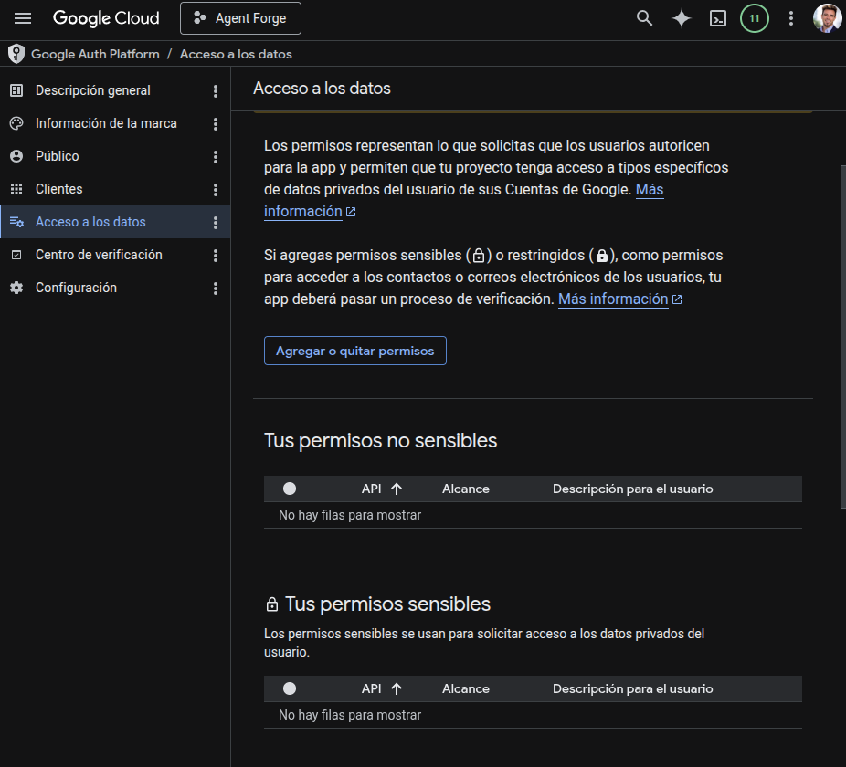

### 5.4 Crear cliente para login web

Ve a:

```text
Google Cloud Console
→ Google Auth Platform
→ Clients
```

Link:

```text
https://console.cloud.google.com/auth/clients
```

También puede aparecer desde:

```text
APIs & Services
→ Credentials
```

Link:

```text
https://console.cloud.google.com/apis/credentials
```

Pulsa:

```text
Create Client
```

o:

```text
Create Credentials → OAuth client ID
```

según la vista que tengas.

#### Paso 5.4.1 — Application type

Selecciona:

```text
Web application
```

Nombre recomendado:

```text
Agent Forge Web Login Test
```

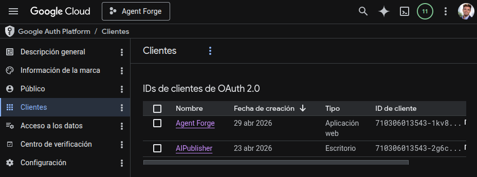

#### Paso 5.4.2 — Authorized JavaScript origins

Como el frontend real de la aplicación está en `agentforge.israellopez.org`, añade:

```text
https://agentforge.israellopez.org
```

Para desarrollo local, añade también:

```text
http://localhost:5173
```

Si usas otro puerto de Vite, añade ese puerto.

Ejemplos:

```text
http://localhost:3000
http://localhost:5173
```

No confundas esto con la landing:

```text
https://www.agentforge.israellopez.org
```

Solo necesitas añadir `www` aquí si desde la landing también ejecutas Google Sign-In directamente.

En tu arquitectura actual:

```text
Landing pública:
https://www.agentforge.israellopez.org

Frontend app:
https://agentforge.israellopez.org
```

por tanto, el JavaScript origin principal es:

```text
https://agentforge.israellopez.org
```

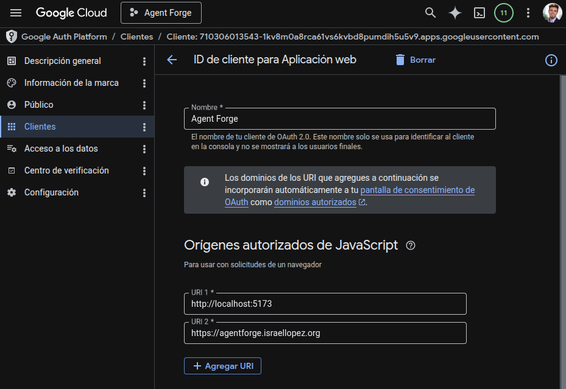

#### Paso 5.4.3 — Authorized redirect URIs

Aqui añadiremos el callback autorizado.

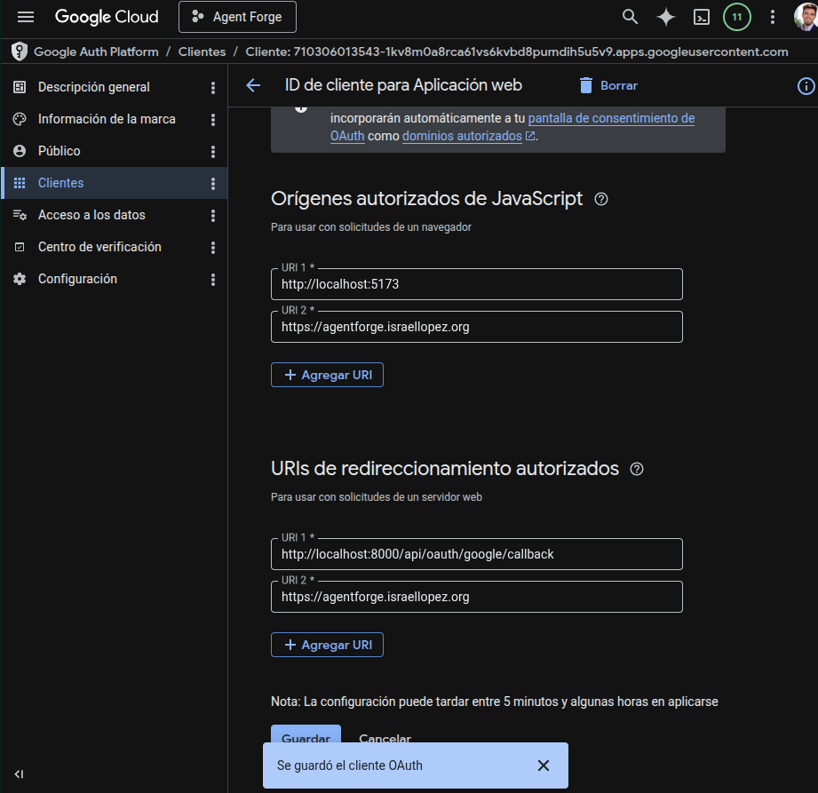

#### Paso 5.4.4 — Guardar Client ID y Client Secret

Guarda el cliente y copia el Client ID y el Client Secret.

Lo usarás en:

```env
VITE_GOOGLE_CLIENT_ID=<client-id>
GOOGLE_CLIENT_ID=<client-id>
GOOGLE_OAUTH_CLIENT_ID=<client-id>
GOOGLE_OAUTH_CLIENT_SECRET=<client-secret>
GOOGLE_OAUTH_REDIRECT_URI=https://api.agentforge.israellopez.org/api/oauth/google/callback
```

---

## 6. Variables finales esperadas

### Frontend de la aplicación

Dominio:

```text
https://agentforge.israellopez.org
```

Variables:

```env
VITE_GOOGLE_CLIENT_ID=<client-id-del-cliente-Agent-Forge-Web-Login-Test>
VITE_API_URL=https://api.agentforge.israellopez.org
```

### Backend/API

Dominio:

```text
https://api.agentforge.israellopez.org
```

Variables:

```env
GOOGLE_CLIENT_ID=<client-id-del-cliente-Agent-Forge-Web-Login-Test>

GOOGLE_OAUTH_CLIENT_ID=<client-id-del-cliente-Agent-Forge-Gmail-OAuth-Backend-Test>
GOOGLE_OAUTH_CLIENT_SECRET=<client-secret-del-cliente-Agent-Forge-Gmail-OAuth-Backend-Test>
GOOGLE_OAUTH_REDIRECT_URI=https://api.agentforge.israellopez.org/api/oauth/google/callback

PUBLIC_APP_URL=https://agentforge.israellopez.org
PUBLIC_BASE_URL=https://api.agentforge.israellopez.org
CORS_ORIGINS=https://agentforge.israellopez.org
```

### Landing pública

Dominio:

```text
https://www.agentforge.israellopez.org
```

Debe exponer públicamente:

```text
https://www.agentforge.israellopez.org/privacy
https://www.agentforge.israellopez.org/terms
```

No deben requerir login.

---

## 7. Estado final esperado

La configuración correcta para tu entorno actual queda así:

```text
Landing / presentación:
https://www.agentforge.israellopez.org

Frontend app:
https://agentforge.israellopez.org

Backend:
https://api.agentforge.israellopez.org

Privacy:
https://www.agentforge.israellopez.org/privacy

Terms:
https://www.agentforge.israellopez.org/terms

OAuth JavaScript Origin:
https://agentforge.israellopez.org

OAuth Gmail callback:
https://api.agentforge.israellopez.org/api/oauth/google/callback

Authorized domain:
israellopez.org
```

---

## 8. Fuentes oficiales

- Google — Configure OAuth consent screen:
  https://developers.google.com/workspace/guides/configure-oauth-consent

- Google — Get Google API Client ID:
  https://developers.google.com/identity/gsi/web/guides/get-google-api-clientid

- Google — OAuth 2.0 for Web Server Applications:
  https://developers.google.com/identity/protocols/oauth2/web-server

- Google — OAuth 2.0 Policies:
  https://developers.google.com/identity/protocols/oauth2/policies

- Google — Brand Verification:
  https://developers.google.com/identity/verification/authentication-verification
