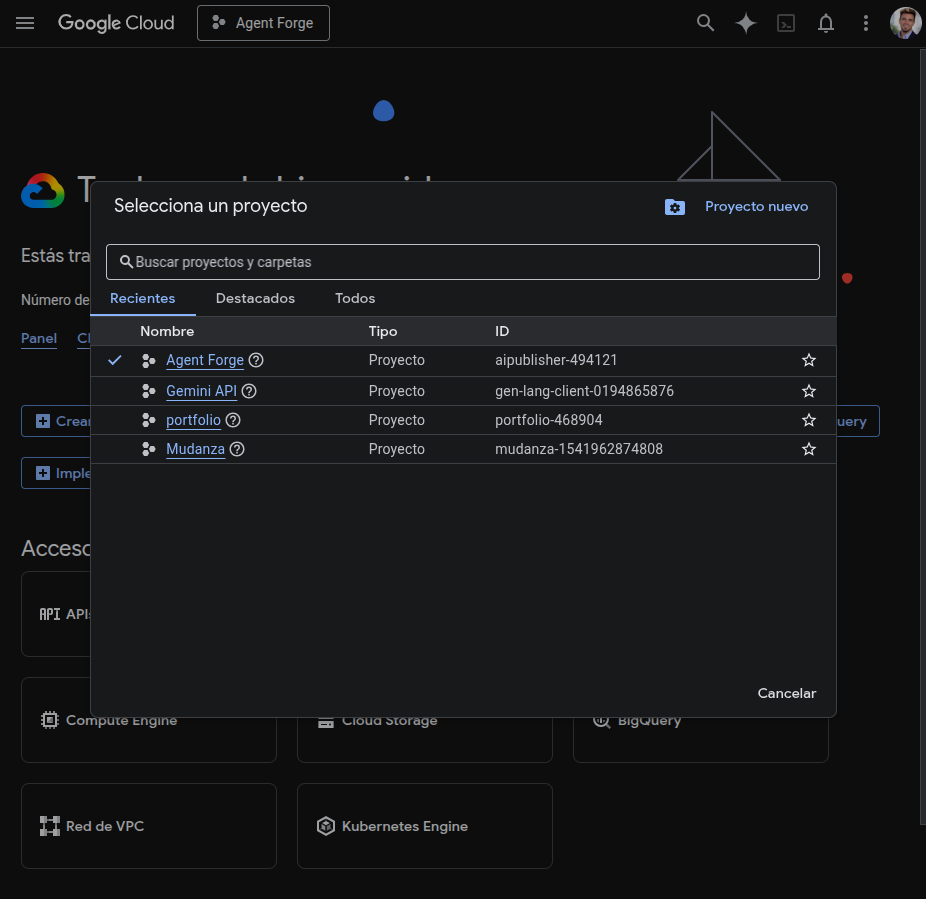
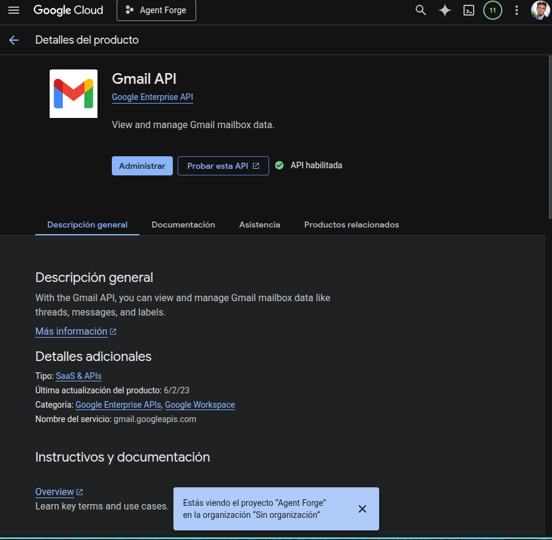
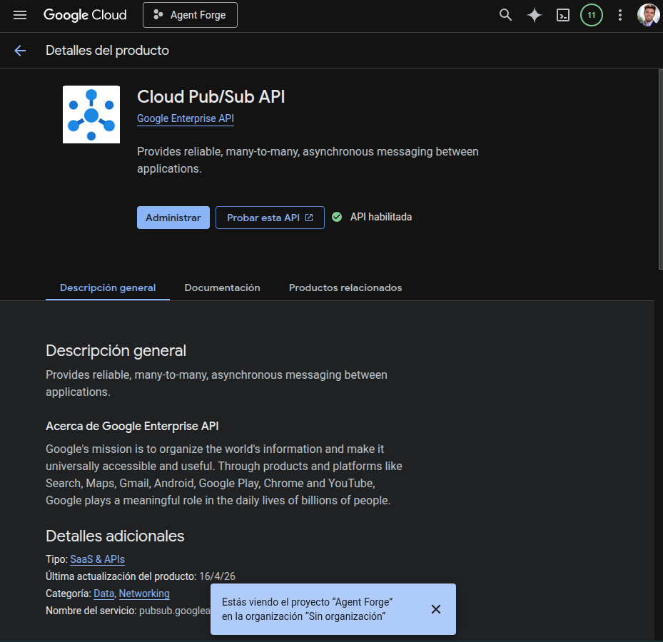

# Agent Forge — Guía paso a paso para configurar Google Pub/Sub con Gmail Push

> Arquitectura actual:
>
> ```text
> Landing / presentación pública:
> https://www.agentforge.israellopez.org
>
> Frontend de la aplicación:
> https://agentforge.israellopez.org
>
> Backend/API:
> https://api.agentforge.israellopez.org
> ```
>
> Endpoint Pub/Sub final:
>
> ```text
> https://api.agentforge.israellopez.org/api/intake/gmail
> ```

---

## 0. Objetivo

Configurar Google Pub/Sub para que Gmail pueda enviar notificaciones push al backend de Agent Forge cuando haya cambios en una cuenta Gmail conectada.

Flujo esperado:

```text
Gmail
  ↓
Google Pub/Sub Topic
  ↓
Pub/Sub Push Subscription autenticada
  ↓
https://api.agentforge.israellopez.org/api/intake/gmail
  ↓
Backend Agent Forge
  ↓
Worker / procesamiento interno
```

Importante:

```text
www.agentforge.israellopez.org
```

solo es la landing pública y las páginas legales.

```text
agentforge.israellopez.org
```

es el frontend de la aplicación.

```text
api.agentforge.israellopez.org
```

es el backend y es el único dominio que debe recibir webhooks de Pub/Sub.

---

## 1. Piezas que vamos a configurar

Necesitas configurar:

```text
1. Cloud Pub/Sub API
2. Gmail API
3. Pub/Sub Topic
4. Permiso para que Gmail publique en el topic
5. Service Account para authenticated push
6. Permiso para que Pub/Sub pueda firmar tokens OIDC
7. Push Subscription hacia el backend
8. Variables de entorno del backend
9. Validación del flujo Gmail users.watch
```

---

## 2. Enlaces oficiales útiles

### Consola

- Google Cloud Console: https://console.cloud.google.com/
- API Library: https://console.cloud.google.com/apis/library
- Enabled APIs: https://console.cloud.google.com/apis/dashboard
- Pub/Sub Topics: https://console.cloud.google.com/cloudpubsub/topic/list
- Pub/Sub Subscriptions: https://console.cloud.google.com/cloudpubsub/subscription/list
- IAM: https://console.cloud.google.com/iam-admin/iam
- Service Accounts: https://console.cloud.google.com/iam-admin/serviceaccounts

### Documentación Google

- Gmail API — Push Notifications: https://developers.google.com/workspace/gmail/api/guides/push
- Pub/Sub — Create push subscriptions: https://cloud.google.com/pubsub/docs/create-push-subscription
- Pub/Sub — Authenticate push subscriptions: https://cloud.google.com/pubsub/docs/authenticate-push-subscriptions
- Pub/Sub — Managing topics: https://cloud.google.com/pubsub/docs/create-topic
- Gmail API — users.watch: https://developers.google.com/workspace/gmail/api/reference/rest/v1/users/watch
- Gmail API — users.history.list: https://developers.google.com/workspace/gmail/api/reference/rest/v1/users.history/list

---

## 3. Valores recomendados para este entorno

Sustituye `<PROJECT_ID>` por el ID real del proyecto de Google Cloud.

```text
GCP Project ID:
<PROJECT_ID>

Topic ID:
agentforge-gmail

Subscription ID:
agentforge-gmail-push

Push service account name:
agentforge-pubsub-pusher

Push endpoint:
https://api.agentforge.israellopez.org/api/intake/gmail

Push OIDC audience:
https://api.agentforge.israellopez.org/api/intake/gmail
```

La `audience` debe coincidir exactamente con la variable del backend:

```env
PLATFORM_GCP_PUBSUB_INTAKE_AUDIENCE=https://api.agentforge.israellopez.org/api/intake/gmail
```

Sin slash final.

Correcto:

```text
https://api.agentforge.israellopez.org/api/intake/gmail
```

Incorrecto:

```text
https://api.agentforge.israellopez.org/api/intake/gmail/
```

---

# Parte A — Preparación del proyecto Google Cloud

## 4. Seleccionar el proyecto correcto

### Paso 4.1 — Entrar en Google Cloud Console

Abre:

```text
https://console.cloud.google.com/
```

Selecciona el proyecto de Google Cloud usado por Agent Forge.



---

### Paso 4.2 — Confirmar Project ID

En la parte superior de Google Cloud Console, confirma el `Project ID`.

Guárdalo aquí:

```text
PROJECT_ID=
```

Ejemplo:

```text
PROJECT_ID=aipublisher-494121
```

---

## 5. Habilitar APIs necesarias

Ve a:

```text
Google Cloud Console
→ APIs & Services
→ Library
```

Link:

```text
https://console.cloud.google.com/apis/library
```

---

### Paso 5.1 — Habilitar Gmail API

Busca:

```text
Gmail API
```

Pulsa:

```text
Enable
```

La Gmail API es necesaria para:

```text
users.watch
users.history.list
users.messages.get
```



---

### Paso 5.2 — Habilitar Cloud Pub/Sub API

Busca:

```text
Cloud Pub/Sub API
```

Pulsa:

```text
Enable
```

Pub/Sub es necesario para recibir notificaciones push de Gmail.



---

# Parte B — Crear el Pub/Sub Topic

## 6. Crear topic desde consola

Ve a:

```text
Google Cloud Console
→ Pub/Sub
→ Topics
```

Link:

```text
https://console.cloud.google.com/cloudpubsub/topic/list
```

Pulsa:

```text
Create topic
```

---

### Paso 6.1 — Topic ID

Introduce:

```text
agentforge-gmail
```

Recomendación:

```text
No crear default subscription automáticamente.
```

La subscription la crearemos manualmente como push autenticado.

---

### Paso 6.2 — Opciones del topic

Deja los valores por defecto salvo que tengas una razón concreta:

```text
Schema:
None

Message retention:
Default

Encryption:
Google-managed encryption key

Default subscription:
Disabled / unchecked
```

Crea el topic.

---

### Paso 6.3 — Copiar nombre completo del topic

El nombre completo debe tener este formato:

```text
projects/<PROJECT_ID>/topics/agentforge-gmail
```

Ejemplo:

```text
projects/aipublisher-494121/topics/agentforge-gmail
```

Este valor irá en el backend:

```env
PLATFORM_GCP_PUBSUB_TOPIC=projects/aipublisher-494121/topics/agentforge-gmail
```

---

## 7. Crear topic con gcloud

Alternativa equivalente por terminal:

```bash
PROJECT_ID="<PROJECT_ID>"
TOPIC_ID="agentforge-gmail"

gcloud config set project "$PROJECT_ID"

gcloud pubsub topics create "$TOPIC_ID"
```

Comprobar:

```bash
gcloud pubsub topics list
```

---

# Parte C — Permitir que Gmail publique en el topic

## 8. Añadir permiso Pub/Sub Publisher a Gmail

Gmail usa esta service account especial para publicar eventos en tu topic:

```text
gmail-api-push@system.gserviceaccount.com
```

Debes darle permiso:

```text
Pub/Sub Publisher
```

sobre el topic.

---

## 9. Dar permiso desde consola

Ve a:

```text
Pub/Sub
→ Topics
→ agentforge-gmail
```

Abre la pestaña o panel:

```text
Permissions
```

Pulsa:

```text
Add principal
```

Principal:

```text
gmail-api-push@system.gserviceaccount.com
```

Role:

```text
Pub/Sub Publisher
```

Equivalente técnico:

```text
roles/pubsub.publisher
```

Guarda.

---

## 10. Dar permiso con gcloud

```bash
PROJECT_ID="<PROJECT_ID>"
TOPIC_ID="agentforge-gmail"

gcloud config set project "$PROJECT_ID"

gcloud pubsub topics add-iam-policy-binding "$TOPIC_ID" \
  --member="serviceAccount:gmail-api-push@system.gserviceaccount.com" \
  --role="roles/pubsub.publisher"
```

Comprobar permisos:

```bash
gcloud pubsub topics get-iam-policy "$TOPIC_ID"
```

Busca:

```text
gmail-api-push@system.gserviceaccount.com
roles/pubsub.publisher
```

---

# Parte D — Crear Service Account para Pub/Sub Push autenticado

## 11. Por qué necesitamos esta service account

La push subscription llamará a tu backend:

```text
https://api.agentforge.israellopez.org/api/intake/gmail
```

Para que tu backend pueda confiar en que la llamada viene de Pub/Sub, la subscription debe enviar un token OIDC firmado por Google.

Ese token se enviará en el header:

```http
Authorization: Bearer <JWT>
```

La identidad usada para firmar el token será esta service account:

```text
agentforge-pubsub-pusher@<PROJECT_ID>.iam.gserviceaccount.com
```

Tu backend debe validar:

```text
issuer
audience
email / subject
firma del token
```

---

## 12. Crear service account desde consola

Ve a:

```text
Google Cloud Console
→ IAM & Admin
→ Service Accounts
```

Link:

```text
https://console.cloud.google.com/iam-admin/serviceaccounts
```

Pulsa:

```text
Create service account
```

---

### Paso 12.1 — Service account details

Service account name:

```text
agentforge-pubsub-pusher
```

Service account ID:

```text
agentforge-pubsub-pusher
```

Description:

```text
Service account used by Pub/Sub push subscriptions to authenticate requests to Agent Forge backend.
```

Pulsa:

```text
Create and continue
```

---

### Paso 12.2 — Grant this service account access to project

No hace falta darle permisos amplios al proyecto.

Puedes dejar esta parte vacía y continuar.

---

### Paso 12.3 — Done

Finaliza la creación.

El email final será:

```text
agentforge-pubsub-pusher@<PROJECT_ID>.iam.gserviceaccount.com
```

Guárdalo:

```text
PUSH_SERVICE_ACCOUNT_EMAIL=
```

---

## 13. Crear service account con gcloud

```bash
PROJECT_ID="<PROJECT_ID>"
PUSH_SA_NAME="agentforge-pubsub-pusher"

gcloud config set project "$PROJECT_ID"

gcloud iam service-accounts create "$PUSH_SA_NAME" \
  --display-name="Agent Forge Pub/Sub pusher" \
  --description="Service account used by Pub/Sub push subscriptions to authenticate requests to Agent Forge backend."
```

Comprobar:

```bash
gcloud iam service-accounts list \
  --filter="email:${PUSH_SA_NAME}@${PROJECT_ID}.iam.gserviceaccount.com"
```

---

# Parte E — Permitir que Pub/Sub firme tokens OIDC

## 14. Por qué hace falta este permiso

Para que Pub/Sub pueda generar un token OIDC usando la service account:

```text
agentforge-pubsub-pusher@<PROJECT_ID>.iam.gserviceaccount.com
```

el service agent interno de Pub/Sub necesita el permiso:

```text
Service Account Token Creator
```

Rol técnico:

```text
roles/iam.serviceAccountTokenCreator
```

El service agent de Pub/Sub tiene este formato:

```text
service-<PROJECT_NUMBER>@gcp-sa-pubsub.iam.gserviceaccount.com
```

---

## 15. Obtener PROJECT_NUMBER

Con `gcloud`:

```bash
PROJECT_ID="<PROJECT_ID>"

PROJECT_NUMBER="$(gcloud projects describe "$PROJECT_ID" --format="value(projectNumber)")"

echo "$PROJECT_NUMBER"
```

Guarda:

```text
PROJECT_NUMBER=
```

El service agent será:

```text
service-<PROJECT_NUMBER>@gcp-sa-pubsub.iam.gserviceaccount.com
```

Ejemplo:

```text
service-123456789012@gcp-sa-pubsub.iam.gserviceaccount.com
```

---

## 16. Dar permiso desde consola

Ve a:

```text
IAM & Admin
→ IAM
```

Link:

```text
https://console.cloud.google.com/iam-admin/iam
```

Pulsa:

```text
Grant access
```

Principal:

```text
service-<PROJECT_NUMBER>@gcp-sa-pubsub.iam.gserviceaccount.com
```

Role:

```text
Service Account Token Creator
```

Equivalente técnico:

```text
roles/iam.serviceAccountTokenCreator
```

Guarda.

---

## 17. Dar permiso con gcloud

```bash
PROJECT_ID="<PROJECT_ID>"

PROJECT_NUMBER="$(gcloud projects describe "$PROJECT_ID" --format="value(projectNumber)")"

gcloud projects add-iam-policy-binding "$PROJECT_ID" \
  --member="serviceAccount:service-${PROJECT_NUMBER}@gcp-sa-pubsub.iam.gserviceaccount.com" \
  --role="roles/iam.serviceAccountTokenCreator"
```

Comprobar:

```bash
gcloud projects get-iam-policy "$PROJECT_ID" \
  --flatten="bindings[].members" \
  --filter="bindings.members:service-${PROJECT_NUMBER}@gcp-sa-pubsub.iam.gserviceaccount.com" \
  --format="table(bindings.role)"
```

Debe aparecer:

```text
roles/iam.serviceAccountTokenCreator
```

---

# Parte F — Crear Push Subscription hacia el backend

## 18. Crear subscription desde consola

Ve a:

```text
Google Cloud Console
→ Pub/Sub
→ Subscriptions
```

Link:

```text
https://console.cloud.google.com/cloudpubsub/subscription/list
```

Pulsa:

```text
Create subscription
```

---

### Paso 18.1 — Subscription ID

Introduce:

```text
agentforge-gmail-push
```

---

### Paso 18.2 — Seleccionar topic

En:

```text
Select a Cloud Pub/Sub topic
```

elige:

```text
agentforge-gmail
```

---

### Paso 18.3 — Delivery type

Selecciona:

```text
Push
```

Endpoint URL:

```text
https://api.agentforge.israellopez.org/api/intake/gmail
```

Importante:

```text
Debe ser HTTPS público.
Debe tener certificado TLS válido.
Debe ser accesible desde Internet.
No puede ser localhost.
No puede ser una URL privada.
```

---

### Paso 18.4 — Authentication

Activa:

```text
Enable authentication
```

Service account:

```text
agentforge-pubsub-pusher@<PROJECT_ID>.iam.gserviceaccount.com
```

Audience:

```text
https://api.agentforge.israellopez.org/api/intake/gmail
```

Debe coincidir exactamente con:

```env
PLATFORM_GCP_PUBSUB_INTAKE_AUDIENCE=https://api.agentforge.israellopez.org/api/intake/gmail
```

---

### Paso 18.5 — Ack deadline

Configura:

```text
Ack deadline:
30 seconds
```

El endpoint debe responder rápido con HTTP 2xx.

No proceses todo el email dentro del webhook.

Recomendación:

```text
Webhook:
recibe → valida → guarda/encola → responde 200/204

Worker:
procesa Gmail history después
```

---

### Paso 18.6 — Message retention

Puedes dejar el valor por defecto.

Recomendación:

```text
Message retention duration:
7 days
```

---

### Paso 18.7 — Expiration period

Para pruebas, puedes dejar default.

Si la consola permite elegir:

```text
Never expire
```

es lo más cómodo para evitar que la subscription desaparezca por inactividad.

---

### Paso 18.8 — Retry policy

Deja:

```text
Retry immediately
```

o el valor por defecto.

No configures dead letter todavía salvo que quieras depurar eventos fallidos de forma avanzada.

---

### Paso 18.9 — Payload unwrapping

Para este proyecto, deja desactivado:

```text
Payload unwrapping:
Disabled
```

Motivo: normalmente el backend espera el formato estándar de Pub/Sub:

```json
{
  "message": {
    "data": "...",
    "messageId": "...",
    "publishTime": "..."
  },
  "subscription": "..."
}
```

Si activas payload unwrapping, el body que recibe tu backend cambia y puede romper el parser.

---

### Paso 18.10 — Crear subscription

Pulsa:

```text
Create
```

---

## 19. Crear subscription con gcloud

```bash
PROJECT_ID="<PROJECT_ID>"
TOPIC_ID="agentforge-gmail"
SUB_ID="agentforge-gmail-push"
PUSH_SA_NAME="agentforge-pubsub-pusher"
PUSH_ENDPOINT="https://api.agentforge.israellopez.org/api/intake/gmail"

gcloud config set project "$PROJECT_ID"

gcloud pubsub subscriptions create "$SUB_ID" \
  --topic="$TOPIC_ID" \
  --push-endpoint="$PUSH_ENDPOINT" \
  --push-auth-service-account="${PUSH_SA_NAME}@${PROJECT_ID}.iam.gserviceaccount.com" \
  --push-auth-token-audience="$PUSH_ENDPOINT" \
  --ack-deadline=30
```

Comprobar:

```bash
gcloud pubsub subscriptions describe "$SUB_ID"
```

Busca:

```text
pushConfig.pushEndpoint
pushConfig.oidcToken.serviceAccountEmail
pushConfig.oidcToken.audience
```

Deben ser:

```text
pushEndpoint:
https://api.agentforge.israellopez.org/api/intake/gmail

serviceAccountEmail:
agentforge-pubsub-pusher@<PROJECT_ID>.iam.gserviceaccount.com

audience:
https://api.agentforge.israellopez.org/api/intake/gmail
```

---

# Parte G — Variables de entorno del backend

## 20. Variables obligatorias

En el `.env` del backend:

```env
PLATFORM_GCP_PUBSUB_TOPIC=projects/<PROJECT_ID>/topics/agentforge-gmail
PLATFORM_GCP_PUBSUB_INTAKE_AUDIENCE=https://api.agentforge.israellopez.org/api/intake/gmail
```

Además, para tu arquitectura actual:

```env
PUBLIC_APP_URL=https://agentforge.israellopez.org
PUBLIC_BASE_URL=https://api.agentforge.israellopez.org
CORS_ORIGINS=https://agentforge.israellopez.org
```

---

## 21. Variables que NO deben apuntar a Pub/Sub

No uses estos dominios para Pub/Sub:

```text
https://www.agentforge.israellopez.org
https://agentforge.israellopez.org
```

Pub/Sub debe llamar solo a:

```text
https://api.agentforge.israellopez.org/api/intake/gmail
```

---

## 22. Reiniciar backend

Después de cambiar variables:

```bash
docker compose restart backend
```

o, si usas otro servicio:

```bash
systemctl restart <servicio-backend>
```

Comprueba logs:

```bash
docker compose logs -f backend
```

---

# Parte H — Validación del endpoint

## 23. Comprobar health del backend

Desde fuera del servidor:

```bash
curl -i https://api.agentforge.israellopez.org/api/health
```

Resultado esperado:

```text
HTTP/2 200
```

o cualquier respuesta saludable equivalente.

Si devuelve:

```text
502
Connection refused
SSL error
DNS error
```

corrige primero Caddy/DNS/backend antes de continuar.

---

## 24. Comprobar endpoint Pub/Sub sin token

Ejecuta:

```bash
curl -i -X POST https://api.agentforge.israellopez.org/api/intake/gmail \
  -H "Content-Type: application/json" \
  -d '{}'
```

Resultados aceptables:

```text
401 Unauthorized
403 Forbidden
400 Bad Request
```

Depende de cómo valide tu backend.

Resultados malos:

```text
404 Not Found
502 Bad Gateway
SSL error
Connection refused
```

Si devuelve 404, la ruta no existe o Caddy no está enviando al backend correcto.

---

# Parte I — Probar Pub/Sub manualmente

## 25. Publicar mensaje de prueba en el topic

Esto prueba:

```text
Pub/Sub Topic
→ Push Subscription
→ Backend
```

No prueba Gmail todavía.

Ejecuta:

```bash
PROJECT_ID="<PROJECT_ID>"
TOPIC_ID="agentforge-gmail"

gcloud config set project "$PROJECT_ID"

gcloud pubsub topics publish "$TOPIC_ID" \
  --message='{"emailAddress":"israel.lopez.developer@gmail.com","historyId":"1234567890"}'
```

Luego mira logs del backend:

```bash
docker compose logs -f backend
```

---

## 26. Qué esperar en backend

Si la subscription está bien, Pub/Sub llamará al backend con body estándar:

```json
{
  "message": {
    "data": "eyJlbWFpbEFkZHJlc3MiOiJpc3JhZWwubG9wZXouZGV2ZWxvcGVyQGdtYWlsLmNvbSIsImhpc3RvcnlJZCI6IjEyMzQ1Njc4OTAifQ==",
    "messageId": "...",
    "publishTime": "..."
  },
  "subscription": "projects/<PROJECT_ID>/subscriptions/agentforge-gmail-push"
}
```

Al decodificar `message.data`, tu backend verá:

```json
{
  "emailAddress": "israel.lopez.developer@gmail.com",
  "historyId": "1234567890"
}
```

---

## 27. Si el backend rechaza el mensaje manual

Revisa:

```text
1. La subscription tiene authentication activado.
2. La service account es correcta.
3. La audience coincide exactamente.
4. El backend valida esa audience.
5. El backend acepta el issuer de Google.
6. El backend acepta el email de la service account.
```

---

# Parte J — Activar Gmail users.watch

## 28. Qué hace users.watch

Pub/Sub solo entrega mensajes.

Para que Gmail empiece a publicar cambios, el backend debe llamar a:

```text
gmail.users.watch
```

por cada cuenta Gmail conectada.

La llamada usa el topic:

```text
projects/<PROJECT_ID>/topics/agentforge-gmail
```

---

## 29. Payload esperado de users.watch

Ejemplo:

```json
{
  "topicName": "projects/<PROJECT_ID>/topics/agentforge-gmail",
  "labelIds": ["INBOX"],
  "labelFilterBehavior": "INCLUDE"
}
```

Según tu caso, puedes ajustar filtros de labels, pero para empezar `INBOX` es razonable.

---

## 30. Respuesta esperada de users.watch

Gmail devuelve algo parecido a:

```json
{
  "historyId": "1234567890",
  "expiration": "1710000000000"
}
```

Debes guardar:

```text
historyId inicial
expiration
emailAddress / usuario conectado
```

---

## 31. Notificación inmediata

Cuando `users.watch` se configura correctamente, Gmail suele enviar una notificación inicial al topic.

Eso significa que al activar un workflow Gmail en Agent Forge deberías ver una llamada casi inmediata a:

```text
POST https://api.agentforge.israellopez.org/api/intake/gmail
```

---

# Parte K — Procesar eventos correctamente

## 32. Qué manda Gmail realmente

Gmail no manda el email completo.

Manda solo:

```json
{
  "emailAddress": "user@example.com",
  "historyId": "9876543210"
}
```

---

## 33. Qué debe hacer el backend

Flujo correcto:

```text
1. Recibir Pub/Sub push
2. Validar JWT OIDC
3. Leer message.data
4. Decodificar Base64URL/Base64
5. Extraer emailAddress e historyId
6. Buscar integración Gmail activa para ese emailAddress
7. Recuperar último historyId guardado
8. Llamar Gmail users.history.list(startHistoryId=<último_historyId>)
9. Procesar cambios
10. Guardar nuevo historyId
```

---

## 34. No procesar pesado dentro del webhook

Recomendación:

```text
Webhook:
- valida
- guarda evento
- encola job
- responde 200/204 rápido

Worker:
- llama Gmail API
- procesa history
- clasifica email
- ejecuta workflow
```

Si el webhook tarda o devuelve error, Pub/Sub reintentará.

---

# Parte L — Renovación del watch

## 35. El watch de Gmail caduca

Gmail watch no es permanente.

Debe renovarse periódicamente.

Recomendación:

```text
Renovar users.watch una vez al día para cada integración Gmail activa.
```

---

## 36. Job periódico recomendado

Crear tarea diaria:

```text
Cada día:
  Para cada Gmail integration activa:
    llamar users.watch
    guardar expiration
    guardar historyId devuelto si corresponde
```

Si no renuevas, Pub/Sub seguirá existiendo, pero Gmail dejará de publicar eventos para esa cuenta.

---

# Parte M — Migrar desde ngrok

## 37. Qué cambia al dejar ngrok

Antes probablemente tenías algo como:

```text
https://<ngrok>.ngrok-free.app/api/intake/gmail
```

Ahora debe ser:

```text
https://api.agentforge.israellopez.org/api/intake/gmail
```

Hay que actualizar:

```text
Push subscription endpoint
Push subscription audience
Backend env PLATFORM_GCP_PUBSUB_INTAKE_AUDIENCE
```

---

## 38. Actualizar subscription existente con gcloud

Si ya tienes una subscription creada, no hace falta borrarla.

```bash
PROJECT_ID="<PROJECT_ID>"
SUB_ID="<SUBSCRIPTION_ID_EXISTENTE>"
PUSH_SA_NAME="agentforge-pubsub-pusher"
PUSH_ENDPOINT="https://api.agentforge.israellopez.org/api/intake/gmail"

gcloud config set project "$PROJECT_ID"

gcloud pubsub subscriptions update "$SUB_ID" \
  --push-endpoint="$PUSH_ENDPOINT" \
  --push-auth-service-account="${PUSH_SA_NAME}@${PROJECT_ID}.iam.gserviceaccount.com" \
  --push-auth-token-audience="$PUSH_ENDPOINT" \
  --ack-deadline=30
```

---

## 39. Actualizar variables del backend tras migrar

```env
PLATFORM_GCP_PUBSUB_INTAKE_AUDIENCE=https://api.agentforge.israellopez.org/api/intake/gmail
PLATFORM_GCP_PUBSUB_TOPIC=projects/<PROJECT_ID>/topics/agentforge-gmail
```

Reinicia backend:

```bash
docker compose restart backend
```

---

## 40. Volver a ejecutar users.watch

Después de migrar de ngrok a dominio real, conviene reactivar el watch Gmail desde la app.

Motivo:

```text
La subscription puede cambiar de endpoint.
La app puede tener un nuevo topic/env.
El backend debe guardar historyId y expiration frescos.
```

---

# Parte N — Checklist final

## 41. Google APIs

```text
[ ] Gmail API habilitada
[ ] Cloud Pub/Sub API habilitada
```

---

## 42. Topic

```text
[ ] Topic creado:
    agentforge-gmail

[ ] Nombre completo:
    projects/<PROJECT_ID>/topics/agentforge-gmail

[ ] Backend tiene:
    PLATFORM_GCP_PUBSUB_TOPIC=projects/<PROJECT_ID>/topics/agentforge-gmail
```

---

## 43. Permiso Gmail

```text
[ ] Principal:
    gmail-api-push@system.gserviceaccount.com

[ ] Rol:
    Pub/Sub Publisher

[ ] Scope:
    sobre el topic agentforge-gmail
```

---

## 44. Push service account

```text
[ ] Service account creada:
    agentforge-pubsub-pusher@<PROJECT_ID>.iam.gserviceaccount.com
```

---

## 45. Pub/Sub token creator

```text
[ ] Principal:
    service-<PROJECT_NUMBER>@gcp-sa-pubsub.iam.gserviceaccount.com

[ ] Rol:
    Service Account Token Creator
```

---

## 46. Push subscription

```text
[ ] Subscription creada:
    agentforge-gmail-push

[ ] Delivery type:
    Push

[ ] Endpoint:
    https://api.agentforge.israellopez.org/api/intake/gmail

[ ] Authentication:
    Enabled

[ ] Service account:
    agentforge-pubsub-pusher@<PROJECT_ID>.iam.gserviceaccount.com

[ ] Audience:
    https://api.agentforge.israellopez.org/api/intake/gmail

[ ] Payload unwrapping:
    Disabled
```

---

## 47. Backend

```text
[ ] Backend accesible en:
    https://api.agentforge.israellopez.org

[ ] Endpoint existe:
    POST /api/intake/gmail

[ ] Env:
    PLATFORM_GCP_PUBSUB_TOPIC=projects/<PROJECT_ID>/topics/agentforge-gmail

[ ] Env:
    PLATFORM_GCP_PUBSUB_INTAKE_AUDIENCE=https://api.agentforge.israellopez.org/api/intake/gmail

[ ] Valida JWT OIDC de Pub/Sub
[ ] Responde 2xx rápido
[ ] Encola procesamiento interno
```

---

## 48. Gmail watch

```text
[ ] El backend llama users.watch al activar integración Gmail
[ ] users.watch usa topicName correcto
[ ] Se guarda historyId inicial
[ ] Se guarda expiration
[ ] Existe renovación diaria de watch
[ ] Se procesa users.history.list con startHistoryId correcto
```

---

# Parte O — Errores típicos

## 49. Error: users.watch falla por permisos

Síntoma:

```text
Gmail no puede publicar en el topic.
```

Causa probable:

```text
Falta Pub/Sub Publisher para:
gmail-api-push@system.gserviceaccount.com
```

Solución:

```bash
gcloud pubsub topics add-iam-policy-binding "agentforge-gmail" \
  --member="serviceAccount:gmail-api-push@system.gserviceaccount.com" \
  --role="roles/pubsub.publisher"
```

---

## 50. Error: Pub/Sub no llama al backend

Revisar:

```text
DNS de api.agentforge.israellopez.org
TLS válido
Caddy / reverse proxy
Puerto 443 abierto
Backend escuchando
Subscription en modo Push
Endpoint correcto
```

---

## 51. Error: backend devuelve 401/403 a Pub/Sub

Revisar:

```text
Push authentication enabled
Service account correcta
Audience correcta
PLATFORM_GCP_PUBSUB_INTAKE_AUDIENCE correcto
Permiso Service Account Token Creator concedido
```

---

## 52. Error: llegan notificaciones pero no emails

Esto es normal.

Gmail Pub/Sub no envía emails completos.

Envía:

```text
emailAddress
historyId
```

El backend debe llamar:

```text
users.history.list
```

y después, si hace falta:

```text
users.messages.get
```

---

## 53. Error: dejó de llegar correo tras varios días

Causa probable:

```text
El watch de Gmail caducó.
```

Solución:

```text
Renovar users.watch diariamente para cada integración activa.
```

---

## 54. Error: mensajes duplicados

Puede pasar.

Pub/Sub entrega mensajes al menos una vez, no exactamente una vez.

Tu procesamiento debe ser idempotente:

```text
Guardar messageId procesados
Guardar último historyId
Evitar reprocesar el mismo email/evento
```

---

## 55. Error: invalid startHistoryId

Puede pasar si el `historyId` guardado es demasiado antiguo.

Solución habitual:

```text
1. Hacer resync parcial o completo.
2. Guardar nuevo historyId.
3. Reejecutar users.watch.
```

---

# Parte P — Script completo recomendado

## 56. Script gcloud completo

Edita solo:

```text
PROJECT_ID
```

y ejecuta:

```bash
#!/usr/bin/env bash
set -euo pipefail

PROJECT_ID="<PROJECT_ID>"
TOPIC_ID="agentforge-gmail"
SUB_ID="agentforge-gmail-push"
PUSH_SA_NAME="agentforge-pubsub-pusher"
PUSH_ENDPOINT="https://api.agentforge.israellopez.org/api/intake/gmail"

gcloud config set project "$PROJECT_ID"

echo "Enabling APIs..."
gcloud services enable gmail.googleapis.com
gcloud services enable pubsub.googleapis.com

echo "Creating Pub/Sub topic..."
gcloud pubsub topics create "$TOPIC_ID" || true

echo "Granting Gmail permission to publish..."
gcloud pubsub topics add-iam-policy-binding "$TOPIC_ID" \
  --member="serviceAccount:gmail-api-push@system.gserviceaccount.com" \
  --role="roles/pubsub.publisher"

echo "Creating push service account..."
gcloud iam service-accounts create "$PUSH_SA_NAME" \
  --display-name="Agent Forge Pub/Sub pusher" \
  --description="Service account used by Pub/Sub push subscriptions to authenticate requests to Agent Forge backend." \
  || true

echo "Granting Pub/Sub service agent permission to mint OIDC tokens..."
PROJECT_NUMBER="$(gcloud projects describe "$PROJECT_ID" --format="value(projectNumber)")"

gcloud projects add-iam-policy-binding "$PROJECT_ID" \
  --member="serviceAccount:service-${PROJECT_NUMBER}@gcp-sa-pubsub.iam.gserviceaccount.com" \
  --role="roles/iam.serviceAccountTokenCreator"

echo "Creating authenticated push subscription..."
gcloud pubsub subscriptions create "$SUB_ID" \
  --topic="$TOPIC_ID" \
  --push-endpoint="$PUSH_ENDPOINT" \
  --push-auth-service-account="${PUSH_SA_NAME}@${PROJECT_ID}.iam.gserviceaccount.com" \
  --push-auth-token-audience="$PUSH_ENDPOINT" \
  --ack-deadline=30 \
  || true

echo "Done."
echo
echo "Backend env:"
echo "PLATFORM_GCP_PUBSUB_TOPIC=projects/${PROJECT_ID}/topics/${TOPIC_ID}"
echo "PLATFORM_GCP_PUBSUB_INTAKE_AUDIENCE=${PUSH_ENDPOINT}"
```

---

## 57. Script de verificación

```bash
#!/usr/bin/env bash
set -euo pipefail

PROJECT_ID="<PROJECT_ID>"
TOPIC_ID="agentforge-gmail"
SUB_ID="agentforge-gmail-push"

gcloud config set project "$PROJECT_ID"

echo "Topic:"
gcloud pubsub topics describe "$TOPIC_ID"

echo
echo "Topic IAM:"
gcloud pubsub topics get-iam-policy "$TOPIC_ID"

echo
echo "Subscription:"
gcloud pubsub subscriptions describe "$SUB_ID"

echo
echo "Publishing test message..."
gcloud pubsub topics publish "$TOPIC_ID" \
  --message='{"emailAddress":"israel.lopez.developer@gmail.com","historyId":"1234567890"}'
```

---

# Parte Q — Estado final esperado

Al terminar, la configuración correcta debe ser:

```text
Landing:
https://www.agentforge.israellopez.org

Frontend:
https://agentforge.israellopez.org

Backend:
https://api.agentforge.israellopez.org

Pub/Sub Topic:
projects/<PROJECT_ID>/topics/agentforge-gmail

Pub/Sub Subscription:
agentforge-gmail-push

Push endpoint:
https://api.agentforge.israellopez.org/api/intake/gmail

Push audience:
https://api.agentforge.israellopez.org/api/intake/gmail

Push service account:
agentforge-pubsub-pusher@<PROJECT_ID>.iam.gserviceaccount.com

Gmail publisher:
gmail-api-push@system.gserviceaccount.com

Backend env:
PLATFORM_GCP_PUBSUB_TOPIC=projects/<PROJECT_ID>/topics/agentforge-gmail
PLATFORM_GCP_PUBSUB_INTAKE_AUDIENCE=https://api.agentforge.israellopez.org/api/intake/gmail
```
